# Instrukcja HA

Owner: Łukasz Spirka

**Wymagane**

1. Moduł Deimic Master v3
2. Zainstalowane poniższe aplikacje (zalecany system operacyjny Windows)
    - [MQTT Explorer](https://github.com/thomasnordquist/MQTT-Explorer/releases)
    - [DEIMIC Configurator](https://www.deimic.pl/wsparcie,do-pobrania.html)
3. Skonfigurowana instancja Home Assistant w sieci lokalnej w wersji HA OS (np. na Raspberry Pi). Instrukcje instalacji można znaleźć [na stronie projektu](https://www.home-assistant.io/installation/).
    
    > Zalecamy instalację HA OS, dlatego że instalacja typu container nie umożliwia instalowacji dodatków (Studio Code Server).
    > 

**Wstęp**

Integracja jest możliwa za pośrednictwem protokołu MQTT. Moduł Deimic Master ogłasza każdą zmianę stanu w dedykowanym temacie, który może być subskrybowany przez Home Assistant. Komunikacja działa w obie strony, więc Home Assistant może ustawić stan urządzenia na Master (włączyć / wyłączyć światło, otworzyć / zamknąć zasłonę itp.)

## Krok 1 - dodanie integracji MQTT

1. Należy otworzyć ustawienia, przejść do zakładki "Devices & services", a nastepnie kliknąć "Add integration”

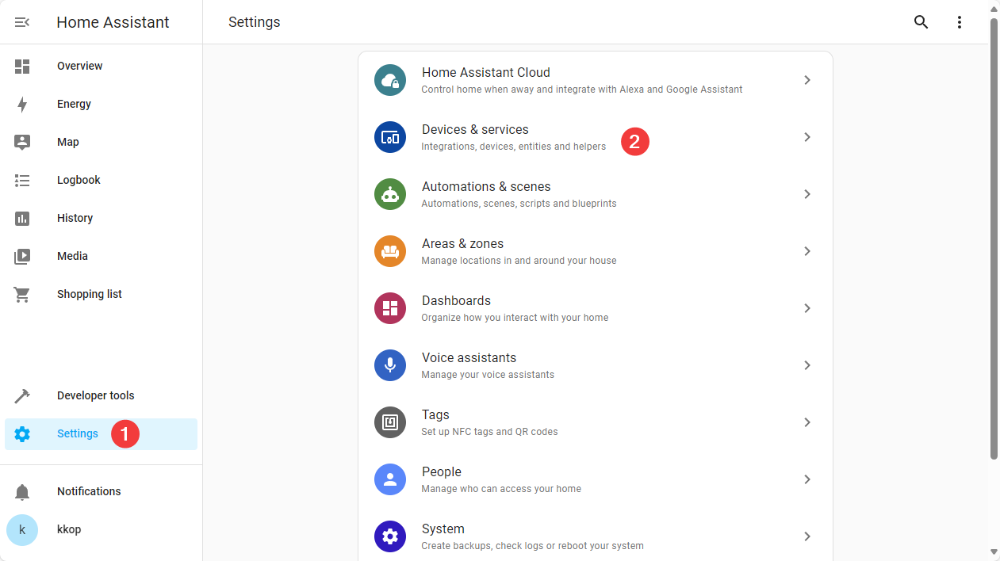

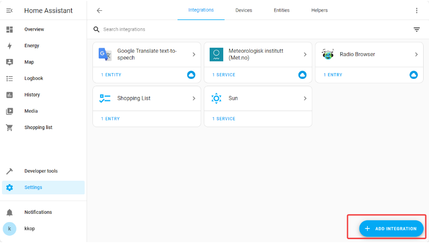

2. Następnie należy wyszukać "MQTT, wybrać integrację z listy, a w następnym okienku wybrać "MQTT" jeszcze raz.

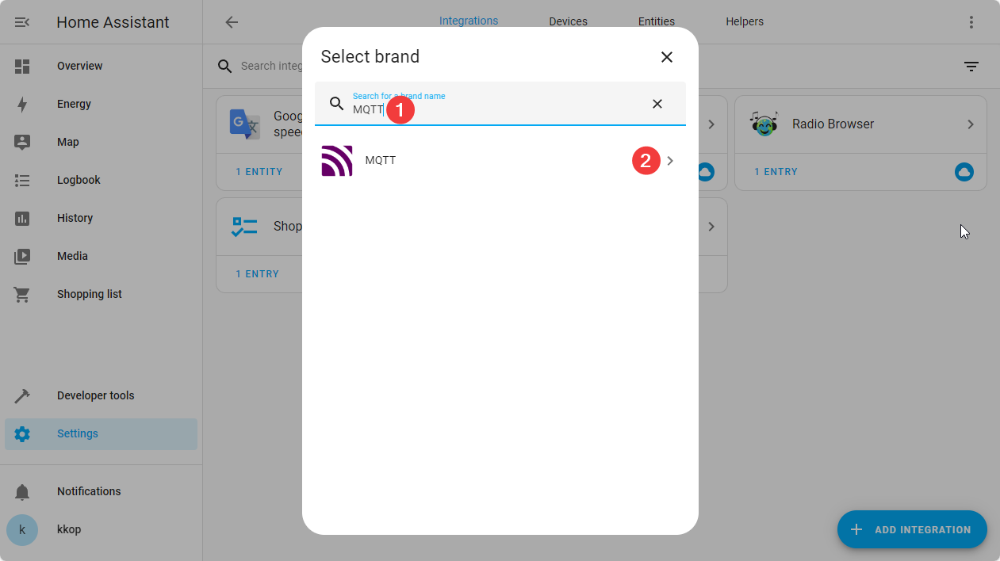

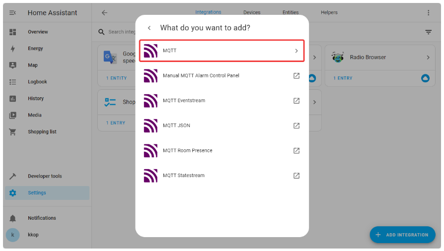

1. W następnym oknie należy podać adres IP modułu Deimic Master (1), numer portu, jeśli jest inny, niż domyślny (2) oraz potwierdzić opcje (3).

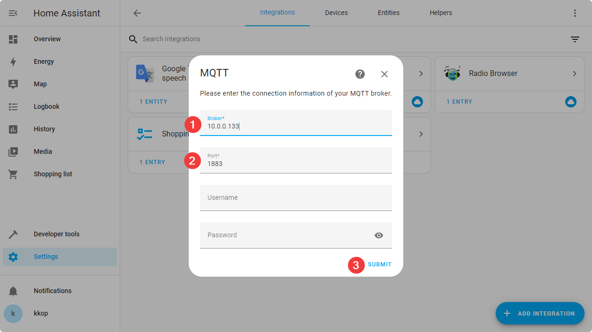

## **Krok 2 - instalacja Studio Code Server**

Jest to dodatek do Home Assistant, który pozwoli na późniejszą edycję plików konfiguracyjnych bezpośrednio z Home Assistant.

1. Należy przejść do ustawień (1) i wybrać "Dodatki" (2)

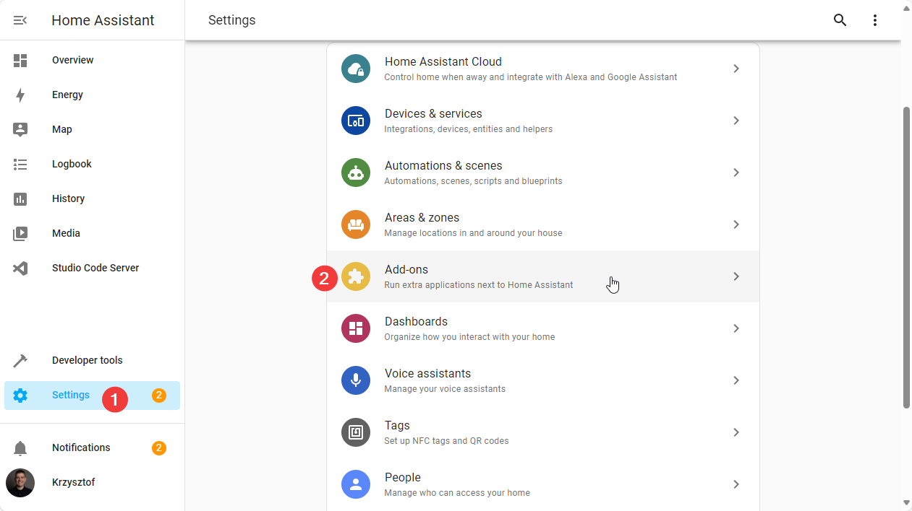

W następnym oknie należy kliknąć "Wyszukaj dodatek" w prawym dolnym rogu, następnie wpisać "Studio Code Server" i wybrać z listy.

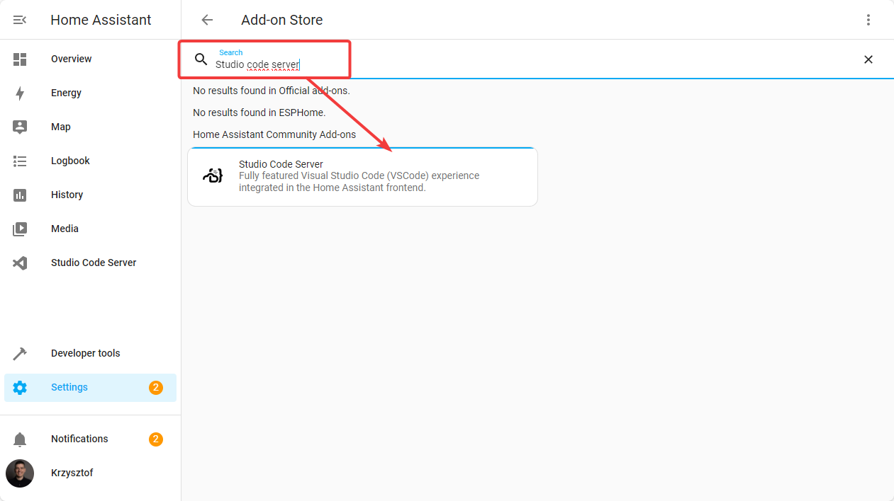

W następnym oknie należy potwierdzić instalację

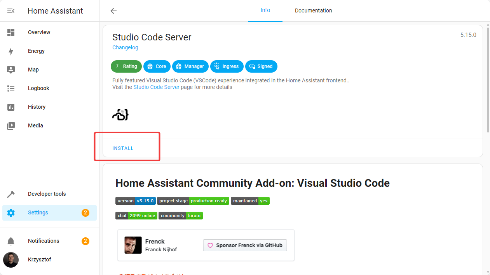

Po zainstalowaniu dodatku, po lewej stronie pojawi się nowa ikona, która umożliwi edycję konfiguracji.

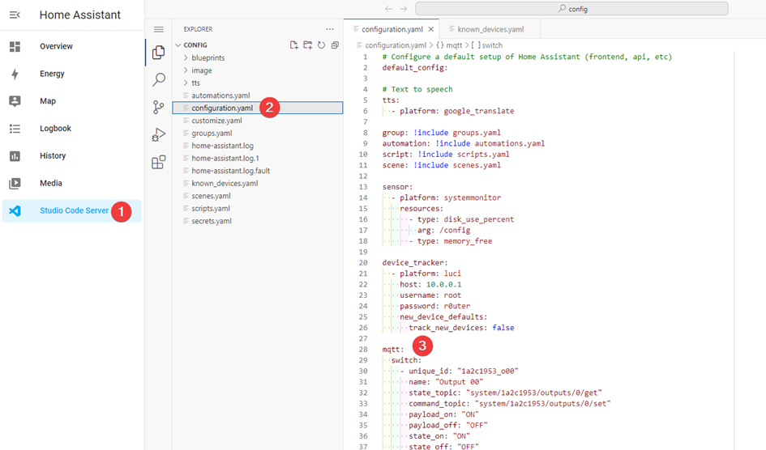

## **Krok 3 - konfiguracja urządzeń**

Urządzenia dodaje się edytując konfigurację (plik `configuration.yaml`). Plik ten ma określoną strukturę, którą należy utrzymać.

**Opis słów kluczowych**

- `mqtt` - musi znajdować się nad całą konfiguracją urządzeń, oznacza że wszystkie wiersze poniżej dotyczą integracji MQTT (patrz krok 1)
- `binary_sensor` / `sensor` / `switch` / etc. - typ klasy urządzenia; więcej informacji [w dokumentacji Home Assistant](https://www.home-assistant.io/docs/configuration/customizing-devices/#device-class)
- `unique_id` – unikalny identyfikator każdego urządzenia; można stosować następujący standard nazewnictwa: `<nr seryjny modułu>_<typ gniazda><numer>`, np. "1a2c1953_o00", gdzie "1a2c1953" to nr seryjny mastera.
- `name` – nazwa, pod jaką urządzenie będzie wyświetlane
- `state_topic` - Temat MQTT z aktualnym stanem urządzenia
- `payload_on`, `payload_off` - wartości, które ustawiają dany stan urządzenia: włączony (`ON`) lub wyłączony (`OFF`)
- `device_class` – konfiguracja typu urządzenia (ustawienie konkretnego czujnika: wilgotności, temperatury, ruchu) - definiuje sposób działania i wygląd urządzenia w Home Assistant; każda klasa urządzeń ma swoje własne typy - więcej szczegółów w dokumentacji Home Assistant, np. [tutaj](https://www.home-assistant.io/integrations/sensor/#device-class)

### **Skąd brać adresy tematów**

Do podglądu komunikacji MQTT służy aplikacja **MQTT Explorer**. Za każdym razem, gdy stan urządzenia zmienia się, odpowiedni temat MQTT zmienia się. W ten sposób można dowiedzieć się, jakie kolejki należy ustawić w konfiguracji Home Assistant.

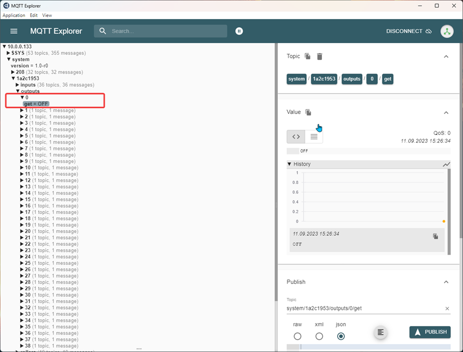

Aplikacja **Deimic Configurator** umożliwia sprawdzenie, do jakiego wyjścia/wejścia podłączone jest dane urządzenie. Wiedząc gdzie szukać, prościej odnaleźć odpowiedni temat w **MQTT Explorer**. Aby sprawdzić daną akcję, rozwiń pole opisu klikając na trójkąt w aplikacji MQTT Explorer.

## Dodanie Studio Code Server do paska bocznego

na czas programowania HA warto dodać skrót SCS do paska bocznego, można to zrobić w następujący sposób:

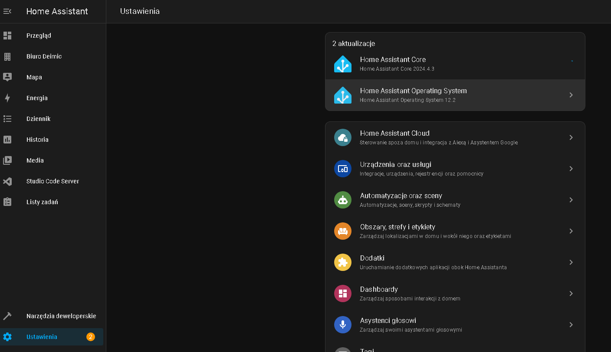

wchodzimy w Ustawienia>Dodatki>Studio Code Server 


następnie zaznaczamy opcje “pokaż na pasku bocznym”

## Wprowadzenie nowego kodu

po każdej aktualizacji kodu warto zrestartować HA w celu implementacji nowego kodu

w celu restartu wchodzimy w narzędzia deweloperskie ,następnie sprawdź konfiguracje, jeśli nie HA nie pokazuje błędu możemy wcisnąć “uruchom ponownie”


## Dodanie włącznika

do zakładki configuration.yaml wklejamy poniższy kod:

```yaml
mqtt:
  switch:
    - unique_id: "1a2c1953_o00"
    name: "Output 00"
    state_topic: "system/1a2c1953/outputs/0/get"
    command_topic: "system/1a2c1953/outputs/0/set"
    payload_on: "ON"
    payload_off: "OFF"
    state_on: "ON"
    state_off: "OFF"
    optimistic: false
    qos: 0
    retain: true

    ////////////////////////////// dodanie kolejnego włącznika 

    - unique_id: "1a2c1953_o01"
    name: "Output 01"
    state_topic: "system/1a2c1953/outputs/1/get"
    command_topic: "system/1a2c1953/outputs/1/set"
    payload_on: "ON"
    payload_off: "OFF"
    state_on: "ON"
    state_off: "OFF"
    optimistic: false
    qos: 0
    retain: true
```

## Zaprogramowanie wyjścia np. żarówki

```yaml
mqtt:
  switch:
    - unique_id: "xxxxxxxx_o01" #NumerSeryjnySterownikaDeimic_Output01
      name: "żarówka 1" #Nazwa wyświetlana w home assistant
      state_topic: "system/xxAxxxx/outputs/1/get" #Temat mqtt słuzacy do odczytywania stanu
      command_topic: "system/xxAxxxx/outputs/1/set" #Temat mqtt słuzacy do zmiany stanu
      payload_on: "ON" #Wiadomość wysyłana przez mqtt w przypadku włączenia w home assistant
      payload_off: "OFF" #Wiadomość wysyłana przez mqtt w przypadku wyłączenia w home assistant
      state_on: "ON"
      state_off: "OFF"
      optimistic: false
      qos: 0
      retain: true
```

xxAxxxx to adres mqtt

## Dodanie suwaka zadającego wartość

Suwak dodajemy w Studio Code Server


w zakładce configuration.yaml dodajemy poniższy kod:

```yaml
input_number:
  slider1:
    name: LED Recepcja #nazwa slidera
    icon: mdi:led-strip #wyświetlana ikonka
    min: 0 #Minimum suwaka
    max: 100 #Maksimum suwaka
    step: 1 # skok suwaka 
```

jeśli chcemy dodać następne suwaki, należy zmienić kod w następujący sposób 

```yaml
  slider2:
    name: LED Salon #nazwa slidera
    icon: mdi:led-strip #wyświetlana ikonka
    min: 0 #Minimum suwaka
    max: 100 #Maksimum suwaka
    step: 1 # skok suwaka 
```

## Dodanie czujnika temperatury

w zakładce configuration.yaml wpisujemy poniższy kod uzupełniając go o swoje dane:

```yaml
  sensor:
    - unique_id: "Temp_sensor_Recepcja"
      name: "Temperatura Recepcja" #Nazwa wyświetlana w home assitancie
      state_topic: "system/xxAxxxx/analog_smart_inputs/33/0/get" #Temat mqtt odbierający wartość temperatury
      unit_of_measurement: "° C" #Jednostka temperatury
      device_class: "temperature"
```

`xxAxxxx` to adres mqtt
adres czujnika temperatury możemy odczytać na podstawie temperatury pokazanej w aplikacji DEIMIC, następnie porównując go z MQTT-Explorer, dodanie kolejnych czujników polega na zmianie nazwy oraz adresu czujnika. 

poniżej przedstawiono kod do programowania innych typów czujników 

```yaml
  sensor:
    - unique_id: "Temp_sensor"
    name: "Temperature"
    state_topic: "system/1a2c1953/analog_smart_inputs/30/0/get"
    unit_of_measurement: "° C"
    device_class: "temperature"
    
    - unique_id: "Humidity_sensor"
    name: "Humidity"
    state_topic: "system/1a2c1953/analog_smart_inputs/24/3/get"
    unit_of_measurement: "%"
    device_class: "moisture"

  binary_sensor:
    - unique_id: "Motion_sensor"
    name: "Motion sensor"
    state_topic: "system/1a2c1953/smart_inputs/24/2/get"
    payload_on: "SHORT:1"
    payload_off: "SHORT:0"
    device_class: "motion"

    - unique_id: "smart_sensor01"
    name: "Smart sensor 01"
    state_topic: "system/1a2c1953/smart_inputs/22/0/get"
    payload_on: "SHORT:1"
    payload_off: "SHORT:0"

    - unique_id: "smart_sensor02"
    name: "Smart sensor 02"
    state_topic: "system/1a2c1953/smart_inputs/22/1/get"
    payload_on: "SHORT:1"
    payload_off: "SHORT:0"

    - unique_id: "smart_sensor01"
    name: "Smart sensor 01"
    state_topic: "system/<nr seryjny Master>/smart_inputs/22/0/get"
    payload_on: "SHORT:1"
    payload_off: "SHORT:0"
```

## Zmiana jasności LED za pomocą suwaka (slidera)

Aby sterować paskami LED (oraz innymi urządzeniami) wchodzimy w zakładkę automations.yaml w Studio Code Server


poniżej pokazano przykładowy kod sterowania paskiem LED za pomocą slidera

```yaml
- id: 'LED_recepcja' # nazwa wewnętrzna
  alias: 'LED' #nazwa wewnętrzna
  trigger:
    platform: state
    entity_id: input_number.slider1 #utworzony slider w pliku configuration.yaml
  action:
    - service: mqtt.publish #akcja mqtt.opublikuj sluzaca do wysylania informacji po mqtt
      data:
        topic: system/xxAxxxx/dimmers/0/set #temat mqtt dotyczący przykładowego paska led.
        payload_template: "SET:{{ states('input_number.slider1') | int }}:100" #treść komendy wysyłanej po mqtt 
        # "SET:wartość suwaka czyli jasność:Czas rozjaśniania" 
        retain: true

- alias: "Aktualizacja led slider" #odpowiedzialne za odczytywanie stanu suwaka. Potrzebne by suwaki były zsynchronizowane pomiedzy deimic a HA
  trigger:
      platform: mqtt # mqtt bez publish bo tylko odczytujemy
      topic: system/xxAxxxx/dimmers/0/get #Temat przykładowego paska led
  action:
      service: input_number.set_value # ustawia suwak na odczytany stan po mqtt
      target:
        entity_id: input_number.slider1 #wybrany suwak
      data:
        value: "{{ trigger.payload }}" 
```

xxAxxxx to adres mqtt

---

 xxAxxxx to adres mqtt

- **`id`** oraz **`alias`**: Są to nazwy wewnętrzne konfiguracji.
- **`trigger`**: Jest to wyzwalacz, który reaguje na zmiany stanu encji (w tym przypadku **`input_number.slider1`**).
- **`action`**: Jest to działanie, które wywołuje usługę MQTT, aby opublikować informacje na określony temat. W tym przypadku, temat i payload są konfigurowane na podstawie wartości suwaka.

jeśli chcemy dodać inne urządzenia, możemy korzystać z powyższego kodu, zmieniając

 -“entity_id” na input_number.(nazwa slidera)

-topic na adres następnego urządzenia którym chcemy sterować (adres pobieramy z MQTT Explorer) zwracając uwagę że “topic” występuje dwa razy, w pierwszej części kodu ma polecenie “/set” natomiast w drugiej “/get”.

poniżej jest pokazany przykładowy wygląd gotowego slidera


## Zmiana ustawienia rolet za pomocą suwaka (slidera)

tak jak w powyższym przykładzie aby sterować roletami za pomocą slidera należy zaprogramować slider w zakładce configuration.yaml. Następnie wchodzimy w automations.yaml i wklejamy poniższy kod uzupełniając go o swoje dane

```yaml
- id: 'Kotara'
  alias: 'Kotara'
  trigger:
    platform: state
    entity_id: input_number.slider3 #wybrany suwak 
  action:
    - service: mqtt.publish # publikowanie mqtt
      data:
        topic: system/xxAxxxx/rollers/1/set # temat set bo ustawiamy
        payload_template: "POSITION:{{ states('input_number.slider3') | int }}" # treść wysylanej komendy "Position:Odczyt z suwaka"
        retain: true 
    - delay: "00:00:02" #opoznienie 2 sekundy

- id: 'aktualizacja_Kotara_slider' #wewnętrzna nazwa
  alias: 'Aktualizacja stanu Kotary na podstawie suwaka' #wewnętrzna nazwa
  trigger:
    platform: mqtt # mqtt odczytujemy stan
    topic: system/xxAxxxx/rollers/1/get #Temat mqtt do odczytywania
  action:
    - service: input_number.set_value #ustawianie suwaka do wartości odczytanej
      target:
        entity_id: input_number.slider3 # identyfikator suwaka
      data:
        value: "{{ trigger.payload.split(':')[1] | int }}" #...ponizej
    - delay: "00:00:02" 
```

xxAxxxx to adres mqtt

sytuacja jest podobna jak przy sterowaniu paskiem led, więc w celu dodania kolejnej rolety, zasłony zmieniamy nazwę suwaka oraz adres urządzenia którym chcemy sterować “topic” (w dwóch miejscach) z uwagą na polecenia /set, /get.

do kodu wprowadzono delay ustawiony na dwie sekundy który zapewnia stabilizację działania, zaleca się dodanie takiego opóźnienia do następnych urządzeń. 

poniżej zdjęcie efektu programu 


## Sterowanie urządzeniem za pomocą przycisków góra/dół

urządzeniami typu roleta lub pasek LED możemy sterować również za pomocą przycisków, wówczas musimy dodać do zakładki configuration.yaml poniższy przykłądowy kod:

```yaml
  cover:
    - unique_id: "10190655_R0" #NumerSeryjnySterownika_Roller0
      name: "Roleta" #Nazwa wyświetlana w HA
      command_topic: "system/xxAxxxx/rollers/0/set" #Temat mqtt słuzacy do zmiany stanu
      state_topic: "system/xxAxxxx/rollers/0/get" #Temat mqtt słuzacy do odczytywania stanu
      qos: 1
      payload_open: "RUN_UP" # Komenda wysyłana w przypadku kliknięcia przycisku otworz w HA
      payload_close: "RUN_DOWN" # Komenda wysyłana w przypadku kliknięcia przycisku zamknij w HA
      payload_stop: "STOP" # Komenda wysyłana w przypadku kliknięcia przycisku stop w HA
      device_class: garage
```

xxAxxxx to adres mqtt

tak jak w przypadku innych urządzeń należy wpisać numer seryjny sterownika rolet w linijce unique_id oraz swój adres urządzenia w linijkach  command_topic i state_topic

poniżej pokazano działanie kodu: 


## Dodawanie kamer do HA

Aby dodać kamery wchodzimy w ten link [kamera](https://my.home-assistant.io/redirect/config_flow_start?domain=mjpeg)

następnie wypełniamy wyskakujące okno 


w polu adres URL dla MJPEG oraz URL dla obranu nieruchomego wklejamy ten sam adres kamery 

adres URL kamery możemy skopiować z np DEIMIC Configurator


## Tworzenie obszarów, pięter

W zakładce ustawienia, wchodzimy w “Obszary, strefy i etykiety”


w prawym dolnym rogu wybieramy pożądaną opcje 

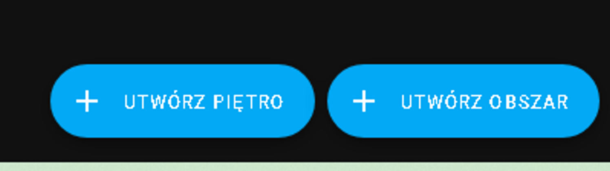

Jako pierwsze dodajemy pomieszczenia czyli obszary

Podczas dodawania piętra wybieramy pomieszczenia, które są na tym poziomie.

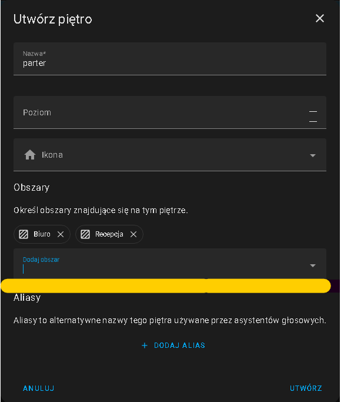

## 

## Przypisanie urządzeń do pomieszczeń

Po dodaniu urządzenia w Studio Code Server, w zakładce Przegląd pojawia się opcja sterowania tym urządzeniem, możemy przypisać je do danego pomieszczenia


w prawym górnym rogu w opcjach zmieniamy obszar 


## Edycja układu pomieszczeń w HA

po skonfigurowaniu wszystkich urządzeń, możemy zmienić kolejność w której będą wyświetlane 


kolejność wyświetlania zmieniamy za pomocą + oraz - 


